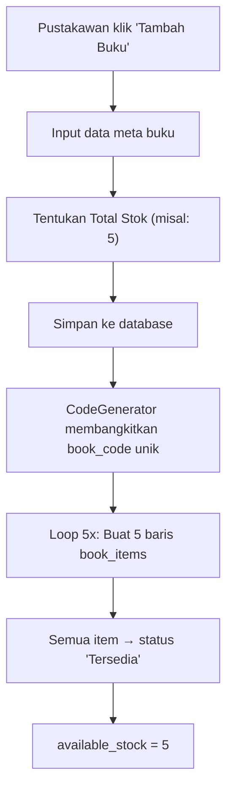
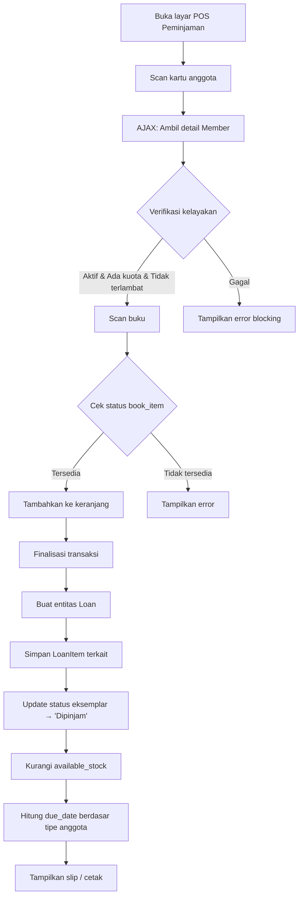
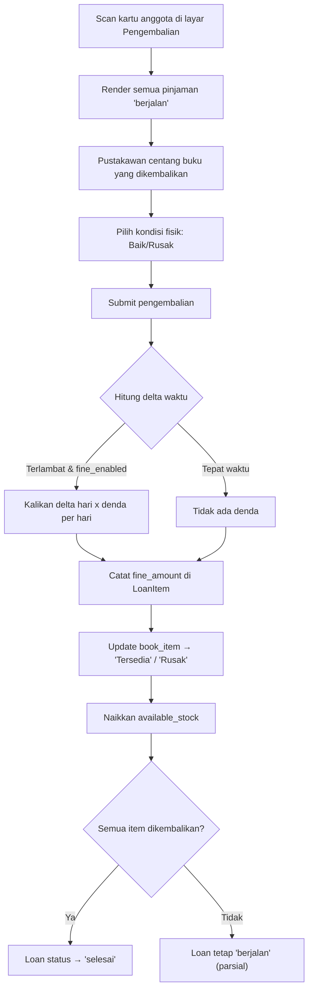
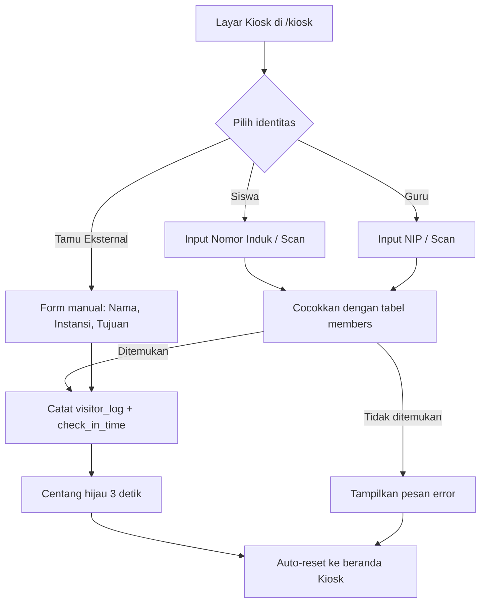
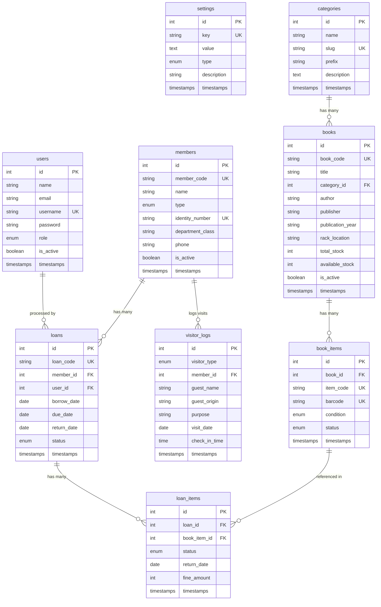

# 📚 MASTER PROMPT & PRODUCT REQUIREMENTS DOCUMENT (PRD)
# Pengembangan Sistem **"PustakaManis"** — Berbasis Laravel

> **Versi Dokumen:** 1.0.0  
> **Tanggal:** 8 Agustus 2026  
> **Status:** Draft — Menunggu Persetujuan  
> **Jenis Dokumen:** Master Prompt + PRD Ekstensif  

---

Dokumen ini merupakan **laporan arsitektur sistem komprehensif**, **spesifikasi produk menyeluruh**, sekaligus **instruksi prompt utama (Master Prompt)** yang secara spesifik dirancang untuk dieksekusi oleh **Agen AI Pemrograman (AI Coding Agent)**.

Agen AI diinstruksikan untuk bertindak sebagai **Senior Full-Stack Developer** dan **System Architect** dalam membangun aplikasi perpustakaan lokal bernama **PustakaManis**.

Seluruh spesifikasi, logika bisnis, desain antarmuka, dan fase pengembangan dari **Fase 0 hingga eksekusi akhir** telah didetailkan untuk menjamin **performa**, **estetika skeuomorphism ringan**, dan **keandalan sistem pada jaringan lokal**. Agen AI wajib mematuhi seluruh spesifikasi naratif dan struktural yang tertuang dalam dokumen ini **tanpa ada pengurangan fitur** dari rancangan aslinya.

---

## Daftar Isi

1. [Konteks Operasional dan Visi Produk](#1-konteks-operasional-dan-visi-produk)
2. [Prinsip Arsitektur Teknologi dan Infrastruktur Lokal](#2-prinsip-arsitektur-teknologi-dan-infrastruktur-lokal)
3. [Ruang Lingkup Fungsional dan Spesifikasi Modul](#3-ruang-lingkup-fungsional-dan-spesifikasi-modul)
4. [Filosofi dan Implementasi Desain: Light Skeuomorphism](#4-filosofi-dan-implementasi-desain-light-skeuomorphism)
5. [Alur Proses Bisnis (Business Process Flow)](#5-alur-proses-bisnis-business-process-flow)
6. [Arsitektur Basis Data (Database Schema)](#6-arsitektur-basis-data-database-schema)
7. [Desain Antarmuka dan Pengalaman Pengguna (UI/UX)](#7-desain-antarmuka-dan-pengalaman-pengguna-uiux)
8. [Logika Otomatisasi Sistem (System Automations)](#8-logika-otomatisasi-sistem-system-automations)
9. [Skenario Penggunaan dan Kriteria Penerimaan](#9-skenario-penggunaan-dan-kriteria-penerimaan)
10. [Keamanan dan Penanganan Error](#10-keamanan-dan-penanganan-error)
11. [Strategi Backup dan Pemulihan Data](#11-strategi-backup-dan-pemulihan-data)
12. [Panduan Instalasi dan Deployment Lokal](#12-panduan-instalasi-dan-deployment-lokal)
13. [Cetak Biru Fase Pengembangan](#13-cetak-biru-fase-pengembangan)
14. [Instruksi Eksekusi Utama untuk Agen AI](#14-instruksi-eksekusi-utama-untuk-agen-ai)
15. [Lampiran](#15-lampiran)

---

## 1. Konteks Operasional dan Visi Produk

### 1.1 Latar Belakang Lingkungan Pengguna

Sistem absensi siswa sebelumnya telah berhasil diimplementasikan di lingkungan **Sekolah Menengah Pertama (SMP)** dengan infrastruktur lokal untuk menghindari biaya hosting cloud tahunan. Sebagai kelanjutan dari keberhasilan tersebut, pihak sekolah membutuhkan **sistem digitalisasi tambahan** untuk fasilitas perpustakaan.

Selama ini, pengelolaan perpustakaan masih mengandalkan pencatatan **buku besar fisik** yang rentan terhadap:

- **Kehilangan data** akibat kerusakan fisik catatan
- **Kesalahan rekapitulasi** manual pada akhir bulan
- **Antrean panjang** saat jam istirahat ketika siswa ingin meminjam buku
- **Ketidakakuratan inventaris** karena tidak ada pelacakan real-time

Sistem yang diberi nama **PustakaManis** ini dirancang untuk mendigitalisasi proses peminjaman buku, pengelolaan inventaris perpustakaan, pencarian katalog, serta pencatatan kunjungan (buku tamu) dengan pendekatan yang sangat efisien dan otomatis.

### 1.2 Tujuan dan Visi Produk

**Visi utama:** Menciptakan aplikasi yang **100% beroperasi di Local Area Network (LAN)**, memiliki performa sangat ringan dengan arsitektur Laravel, Alpine.js, dan Tailwind CSS, serta mengusung antarmuka visual bergaya **Light Skeuomorphism**.

Aplikasi ini dirancang agar beroperasi layaknya aplikasi enterprise yang sangat ramah pengguna (*fool-proof*) bagi operator awam. Pustakawan yang mungkin tidak memiliki latar belakang teknis harus dapat mengoperasikan fitur dengan **tombol-tombol yang jelas dan taktil**.

#### Tujuan Spesifik

| # | Tujuan | Deskripsi |
|---|--------|-----------|
| 1 | **Pencatatan Cepat** | Mencatat transaksi peminjaman dan pengembalian buku dalam hitungan detik menggunakan integrasi alat pemindai (*scanner*) barcode eksternal maupun input manual. |
| 2 | **Manajemen Katalog Rapi** | Mengelola data buku secara terstruktur, lengkap dengan sistem penomoran (*auto-generated code*) dan kategorisasi. |
| 3 | **Buku Tamu Terintegrasi** | Menyediakan daftar kunjungan perpustakaan untuk siswa, guru, dan tamu eksternal yang dapat difungsikan sebagai kiosk swalayan. |
| 4 | **Operasional Bebas Internet** | Mengeliminasi ketergantungan pada koneksi internet eksternal, memastikan aplikasi tetap berjalan optimal meskipun infrastruktur jaringan desa sedang mengalami gangguan. |
| 5 | **Pelaporan Analitis** | Menyediakan laporan berkala yang dapat diekspor ke PDF untuk keperluan audit dan evaluasi kinerja perpustakaan. |

### 1.3 Target Pengguna dan Hak Akses (Role)

Untuk mengakomodasi berbagai skenario di lapangan, sistem dirancang dengan arsitektur **multi-peran** yang membatasi akses berdasarkan kebutuhan operasional.

| Peran (Role) | Deskripsi Akses dan Kebutuhan Sistem |
|---|---|
| **Super Admin** | Memiliki kendali penuh atas sistem, termasuk manajemen pengguna, pengaturan aplikasi, pengaturan konfigurasi batas peminjaman, dan penentuan modul mana saja yang aktif atau dinonaktifkan di dalam bilah navigasi (*sidebar*). |
| **Pustakawan** | Pengguna utama harian. Memiliki akses untuk mengelola data buku, menambah anggota, mengeksekusi transaksi peminjaman dan pengembalian, mencatat kunjungan, serta melihat dan mencetak laporan sirkulasi perpustakaan. |
| **Viewer / Kepala Sekolah** | Hak akses **hanya-baca** (*read-only*). Dapat melihat metrik di dasbor utama dan mencetak laporan bulanan untuk keperluan audit atau evaluasi kinerja perpustakaan, namun **tidak dapat mengubah data**. |
| **Pengunjung (Kiosk)** | Pengguna akhir (siswa, guru, atau tamu) yang berinteraksi dengan sistem hanya melalui layar **Kiosk Buku Tamu**. Mereka **tidak memerlukan akun masuk** (*login*), melainkan cukup memindai kartu atau mengetikkan nama pada layar sentuh yang disediakan. |

### 1.4 Asumsi dan Ketergantungan

| # | Asumsi / Ketergantungan | Keterangan |
|---|---|---|
| 1 | **Jaringan LAN tersedia** | Minimal 1 access point WiFi dan 1 komputer server (bisa PC biasa) |
| 2 | **PHP 8.2+** sudah terinstal | Pada komputer server |
| 3 | **Composer** sudah terinstal | Untuk manajemen dependensi Laravel |
| 4 | **Node.js 18+** sudah terinstal | Untuk kompilasi Vite (Tailwind & Alpine.js) |
| 5 | **Barcode scanner USB** (opsional) | Bertindak sebagai keyboard HID — tidak memerlukan driver khusus |
| 6 | **Printer termal** (opsional) | Untuk mencetak slip peminjaman (58mm / 80mm) |
| 7 | **Browser modern** | Chrome, Edge, atau Firefox versi terbaru |

---

## 2. Prinsip Arsitektur Teknologi dan Infrastruktur Lokal

Agen AI diinstruksikan untuk **mematuhi prinsip arsitektur berikut** dalam menghasilkan struktur kode aplikasi:

### 2.1 Arsitektur Jaringan Lokal (Local-First)

- Aplikasi **tidak boleh bergantung** pada Content Delivery Network (CDN) eksternal untuk assets utama (seperti file CSS dan JavaScript) pada fase production, karena koneksi internet sekolah tidak selalu stabil.
- Seluruh library seperti **Tailwind**, **Alpine.js**, dan **Chart.js** harus dikompilasi secara internal menggunakan **Vite**.
- Sistem berjalan melalui protokol jaringan lokal. Proses pelayanan HTTP dilakukan menggunakan perintah yang mengikat ke seluruh antarmuka jaringan:

```bash
php artisan serve --host=0.0.0.0 --port=8000
```

> **PENTING:** Konfigurasi ini **krusial** agar aplikasi dapat diakses tidak hanya oleh komputer peladen (*server*) di meja pustakawan, tetapi juga oleh perangkat seluler maupun tablet guru piket melalui alamat IPv4 lokal (misalnya `http://192.168.1.10:8000`) selama perangkat tersebut terhubung pada koneksi Wi-Fi (LAN) yang sama.

### 2.2 Optimasi Database SQLite dengan WAL Mode

Mengingat sistem berjalan secara lokal dan pihak sekolah ingin menekan biaya lisensi serta kerumitan instalasi, **SQLite** ditetapkan sebagai mesin basis data (*database engine*) utama.

Namun, SQLite pada pengaturan bawaan rentan terhadap masalah `database locked` saat menghadapi transaksi konkuren, misalnya ketika siswa mengisi buku tamu di layar kiosk bersamaan dengan pustakawan yang memproses pengembalian buku di terminal utama.

#### Konfigurasi WAL Mode

Untuk menanggulangi limitasi ini, sistem **diwajibkan** untuk mengaktifkan **Write-Ahead Logging (WAL) Mode**. Arsitektur WAL mengubah mekanisme penulisan data; alih-alih menulis langsung ke berkas utama yang mengunci seluruh basis data, transaksi diakumulasikan dalam berkas log terpisah, memungkinkan proses baca dan tulis terjadi secara simultan.

Agen AI harus menerapkan konfigurasi ini melalui penyesuaian pada berkas `config/database.php`:

| Parameter | Nilai | Penjelasan |
|---|---|---|
| `journal_mode` | `WAL` | Log transaksi ditangani secara asinkron |
| `busy_timeout` | `5000` | Menunggu 5 detik alih-alih langsung gagal dengan `SQLITE_BUSY` |
| `synchronous` | `NORMAL` | Optimasi kecepatan I/O tanpa mengorbankan integritas data |

```php
// config/database.php — bagian 'sqlite'
'sqlite' => [
    'driver' => 'sqlite',
    'url' => env('DB_URL'),
    'database' => env('DB_DATABASE', database_path('database.sqlite')),
    'prefix' => '',
    'foreign_key_constraints' => env('DB_FOREIGN_KEYS', true),
    // Optimasi WAL Mode untuk Concurrent Access
    'journal_mode' => 'WAL',
    'synchronous' => 'NORMAL',
    'busy_timeout' => 5000,
],
```

### 2.3 Lightweight Tech Stack

> **PERINGATAN:** **Hindari** penggunaan Single Page Application (SPA) yang berat seperti React, Vue, atau Inertia.js yang membutuhkan komputasi peramban tinggi. Aplikasi PustakaManis akan diakses melalui komputer sekolah atau ponsel cerdas dengan spesifikasi rendah.

Pendekatan **Server-Side Rendering (SSR) murni** dengan tumpukan teknologi TALL (*Tailwind, Alpine, Laravel, Livewire*) yang disederhanakan:

```
┌──────────────────────────────────────────────────┐
│                 TECH STACK                        │
├──────────────────────────────────────────────────┤
│  Backend     : Laravel 11 (PHP 8.2+)             │
│  Templating  : Blade Templates (SSR)             │
│  Styling     : Tailwind CSS v3 (compiled)        │
│  Reactivity  : Alpine.js v3 (micro-interactions) │
│  Charts      : Chart.js (compiled via Vite)      │
│  PDF Export  : barryvdh/laravel-dompdf            │
│  Database    : SQLite + WAL Mode                 │
│  Bundler     : Vite                              │
│  Barcode     : milon/barcode (generator)         │
│  Excel/CSV   : maatwebsite/laravel-excel          │
└──────────────────────────────────────────────────┘
```

| Komponen | Teknologi | Alasan |
|---|---|---|
| **Laravel 11** | Backend utama | Perutean, logika bisnis, ORM (Eloquent), pengamanan |
| **Blade Templates** | Komponen antarmuka | Dirender di sisi peladen — ringan di browser |
| **Tailwind CSS** | Kerangka utilitas CSS | Implementasi Light Skeuomorphism tanpa CSS kustom masif |
| **Alpine.js** | Reaktivitas mikro | Transisi dropdown, modal, tabs, focus-trapping pada Kiosk |
| **Chart.js** | Grafik analitik | Line chart, bar chart pada dasbor |
| **DomPDF** | Generator PDF | Ekspor laporan ke format dokumen resmi |
| **SQLite** | Database engine | Tanpa server DB terpisah — satu file `.sqlite` |

### 2.4 Struktur Direktori Proyek

```
sie-library/
├── app/
│   ├── Console/
│   │   └── Commands/
│   │       ├── BackupDatabase.php          # Command backup otomatis
│   │       └── UpdateOverdueLoans.php      # Command update status terlambat
│   ├── Helpers/
│   │   └── SettingHelper.php               # Global helper setting()
│   ├── Http/
│   │   ├── Controllers/
│   │   │   ├── Auth/
│   │   │   │   └── LoginController.php
│   │   │   ├── BookController.php
│   │   │   ├── BookItemController.php
│   │   │   ├── CategoryController.php
│   │   │   ├── DashboardController.php
│   │   │   ├── KioskController.php
│   │   │   ├── LoanController.php
│   │   │   ├── MemberController.php
│   │   │   ├── ReportController.php
│   │   │   ├── ReturnController.php
│   │   │   ├── SettingController.php
│   │   │   ├── UserController.php
│   │   │   └── VisitorLogController.php
│   │   └── Middleware/
│   │       ├── CheckModuleEnabled.php      # Middleware toggle modul
│   │       └── CheckRole.php               # Middleware role-based access
│   ├── Models/
│   │   ├── Book.php
│   │   ├── BookItem.php
│   │   ├── Category.php
│   │   ├── Loan.php
│   │   ├── LoanItem.php
│   │   ├── Member.php
│   │   ├── Setting.php
│   │   ├── User.php
│   │   └── VisitorLog.php
│   ├── Observers/
│   │   └── BookObserver.php                # Auto-generate book_items
│   └── Services/
│       └── CodeGenerator.php               # Algoritma pembentukan kode unik
├── config/
│   └── database.php                        # SQLite WAL configuration
├── database/
│   ├── database.sqlite
│   ├── migrations/
│   │   ├── 0001_01_01_000000_create_users_table.php
│   │   ├── 0001_01_01_000001_create_settings_table.php
│   │   ├── 0001_01_01_000002_create_categories_table.php
│   │   ├── 0001_01_01_000003_create_members_table.php
│   │   ├── 0001_01_01_000004_create_books_table.php
│   │   ├── 0001_01_01_000005_create_book_items_table.php
│   │   ├── 0001_01_01_000006_create_loans_table.php
│   │   ├── 0001_01_01_000007_create_loan_items_table.php
│   │   └── 0001_01_01_000008_create_visitor_logs_table.php
│   └── seeders/
│       ├── DatabaseSeeder.php
│       ├── UserSeeder.php
│       ├── SettingSeeder.php
│       └── CategorySeeder.php
├── public/
│   └── build/                              # Compiled Vite assets (production)
├── resources/
│   ├── css/
│   │   └── app.css                         # Tailwind directives + custom CSS
│   ├── js/
│   │   └── app.js                          # Alpine.js + Chart.js imports
│   └── views/
│       ├── auth/
│       │   └── login.blade.php
│       ├── books/
│       │   ├── index.blade.php
│       │   ├── create.blade.php
│       │   ├── edit.blade.php
│       │   ├── show.blade.php
│       │   └── import.blade.php
│       ├── categories/
│       │   ├── index.blade.php
│       │   └── form.blade.php
│       ├── components/
│       │   ├── alert.blade.php
│       │   ├── badge.blade.php
│       │   ├── button.blade.php
│       │   ├── card.blade.php
│       │   ├── input.blade.php
│       │   ├── modal.blade.php
│       │   ├── search-global.blade.php
│       │   ├── sidebar-link.blade.php
│       │   ├── table.blade.php
│       │   └── toast.blade.php
│       ├── dashboard/
│       │   └── index.blade.php
│       ├── kiosk/
│       │   └── index.blade.php
│       ├── layouts/
│       │   ├── app.blade.php               # Layout utama (sidebar + header)
│       │   ├── kiosk.blade.php             # Layout terisolasi untuk kiosk
│       │   └── print.blade.php             # Layout untuk cetakan (PDF/slip)
│       ├── loans/
│       │   ├── borrow.blade.php            # Antarmuka kasir peminjaman
│       │   ├── return.blade.php            # Antarmuka pengembalian
│       │   └── index.blade.php
│       ├── members/
│       │   ├── index.blade.php
│       │   ├── create.blade.php
│       │   ├── edit.blade.php
│       │   ├── show.blade.php
│       │   └── card-print.blade.php        # Cetak kartu anggota
│       ├── reports/
│       │   ├── index.blade.php
│       │   ├── loans-pdf.blade.php
│       │   ├── overdue-pdf.blade.php
│       │   ├── inventory-pdf.blade.php
│       │   └── visitors-pdf.blade.php
│       ├── settings/
│       │   └── index.blade.php
│       └── users/
│           ├── index.blade.php
│           └── form.blade.php
├── routes/
│   └── web.php
├── start-pustaka.bat                       # Skrip peluncuran Windows
├── tailwind.config.js                      # Konfigurasi skeuomorphism tokens
├── vite.config.js
├── package.json
├── composer.json
└── PRD.md                                  # Dokumen ini
```

---

## 3. Ruang Lingkup Fungsional dan Spesifikasi Modul

Aplikasi mencakup **tujuh modul utama** yang saling terkait untuk mendukung seluruh kegiatan sirkulasi perpustakaan.

### 3.1 Modul Dashboard ("Meja Pustakawan")

Dasbor dirancang untuk menyerupai **ruang kerja visual** yang menyajikan statistik secara intuitif dan interaktif.

#### Indikator Utama (KPI Cards)

| Metrik | Ikon | Deskripsi |
|---|---|---|
| Total Buku | 📚 | Jumlah seluruh judul buku dalam katalog |
| Buku Tersedia | ✅ | Jumlah eksemplar yang berstatus 'tersedia' |
| Buku Dipinjam | 📖 | Jumlah eksemplar yang sedang dipinjam |
| Total Keterlambatan | ⚠️ | Jumlah peminjaman yang melewati batas waktu |
| Kunjungan Hari Ini | 👥 | Total pengunjung perpustakaan hari ini |

#### Grafik Analitik

- **Line Chart**: Tren peminjaman **7 hari terakhir** (Chart.js — dimuat lokal via Vite)
- **Bar Chart**: Tren kunjungan harian
- **Doughnut Chart**: Distribusi kategori buku yang paling sering dipinjam

#### Quick Actions

Pustakawan seringkali membutuhkan akses seketika. Dasbor harus memuat **tombol aksi cepat** yang mencolok:

```
┌──────────────┐  ┌──────────────┐  ┌──────────────┐  ┌──────────────┐
│  📖 PINJAM   │  │  📥 KEMBALI  │  │  ➕ TAMBAH   │  │  🏛️ KIOSK   │
│    BUKU      │  │    BUKU      │  │    BUKU      │  │  BUKU TAMU   │
└──────────────┘  └──────────────┘  └──────────────┘  └──────────────┘
```

#### Pencarian Super (Global Search)

- Bilah pencarian konstan di **tajuk (*header*)** yang selalu terlihat
- Secara dinamis mencari kecocokan: **judul buku**, **kode inventaris**, **nama anggota**, dan **nomor identitas**
- Hasil ditampilkan dalam **dropdown** yang membagi temuan berdasarkan kategorinya
- Implementasi menggunakan **Alpine.js** + endpoint AJAX (`/api/search?q=...`)
- Debounce input **300ms** untuk menghindari spam kueri

### 3.2 Modul Katalog Buku dan Eksemplar

Pengelolaan inventaris buku melibatkan pemisahan antara **entitas konseptual (Buku)** dan **entitas fisik (Eksemplar/Item)**.

#### Data Master Buku

| Field | Tipe | Keterangan |
|---|---|---|
| Judul | String | Judul lengkap buku |
| Penulis | String | Nama pengarang |
| Penerbit | String | Nama penerbit |
| Tahun Terbit | String | Tahun publikasi |
| Kategori | FK → categories | Fiksi, Referensi, Buku Paket, dll. |
| Lokasi Rak | String | Identifikasi rak fisik (opsional) |
| Total Stok | Integer | Jumlah total eksemplar |
| Stok Tersedia | Integer | Counter real-time |

#### Pembangkitan Kode Otomatis (Auto-generate Code)

Pola kode: **`PREFIX-TAHUN-URUTAN`**

```
Contoh:
├── FIK-2026-0001        → Buku Fiksi pertama tahun 2026
│   ├── FIK-2026-0001-01 → Eksemplar ke-1
│   ├── FIK-2026-0001-02 → Eksemplar ke-2
│   └── FIK-2026-0001-03 → Eksemplar ke-3
├── REF-2026-0001        → Buku Referensi pertama tahun 2026
│   └── REF-2026-0001-01 → Eksemplar ke-1
└── PAK-2026-0015        → Buku Paket ke-15 tahun 2026
    ├── PAK-2026-0015-01 → Eksemplar ke-1
    └── PAK-2026-0015-02 → Eksemplar ke-2
```

#### Impor Data Massal

- Format yang didukung: **`.csv`** dan **`.xlsx`**
- Validasi pra-impor: Cek field wajib, duplikasi, format data
- Laporan hasil impor: Jumlah berhasil, gagal, dan alasan kegagalan
- Template CSV/XLSX yang dapat diunduh sebagai panduan pengisian

#### Status Fisik Eksemplar

| Status | Warna Badge | Dampak Bisnis |
|---|---|---|
| `Tersedia` | 🟢 Hijau | Dapat dipinjamkan |
| `Dipinjam` | 🔵 Biru | Tidak dapat dipinjamkan (otomatis) |
| `Rusak` | 🟠 Oranye | Diblokir — perlu evaluasi |
| `Hilang` | 🔴 Merah | Diblokir — perlu penyelidikan |
| `Dalam Perbaikan` | 🟡 Kuning | Diblokir — sementara |

> **CATATAN:** Eksemplar yang **tidak berstatus 'Tersedia'** secara otomatis diblokir dari proses peminjaman baru.

### 3.3 Modul Manajemen Anggota

Buku tidak dapat dipinjamkan tanpa entitas peminjam. Modul ini mendata seluruh partisipan aktif di ekosistem sekolah.

#### Diferensiasi Entitas

| Tipe Anggota | Lama Pinjam Default | Kuota Default | Keterangan |
|---|---|---|---|
| **Siswa** | 7 hari | 2 buku | Terikat kelas (VII-A, VIII-B, dst.) |
| **Guru** | 14 hari | 5 buku | Terikat mata pelajaran/jabatan |
| **Staf** | 14 hari | 3 buku | Staf administrasi sekolah |
| **Eksternal** | - | - | Hanya untuk buku tamu |

> Durasi dan kuota dapat dikonfigurasi melalui **Modul Pengaturan**.

#### Pembuatan Kartu Anggota

- Templat HTML berukuran **kartu standar** (85.6mm × 53.98mm)
- Memuat: **Nama**, **Nomor Induk**, **Kelas**, **Barcode** (representasi kode unik)
- Fitur **cetak massal** menggunakan `window.print()` — layout grid untuk kertas A4
- Barcode yang digenerate oleh library **milon/barcode**

#### Format Kartu Anggota

```
┌─────────────────────────────────────┐
│  PERPUSTAKAAN SMP [NAMA SEKOLAH]    │
│  ─────────────────────────────────  │
│  Nama  : Aisyah Putri              │
│  NIS   : 2026001                    │
│  Kelas : VII-A                      │
│                                     │
│  ║║║║║║║║║║║║║║║║║                  │
│  S-2026001                          │
└─────────────────────────────────────┘
```

### 3.4 Modul Transaksi Peminjaman & Pengembalian

Mekanika inti aplikasi yang menjamin kelancaran sirkulasi literasi sekolah.

#### 3.4.1 Antarmuka Kasir (Point of Sale Style)

```
┌──────────────────────────────────────────────────────────────────┐
│  📖 TRANSAKSI PEMINJAMAN                                        │
├──────────────────────────────────────────────────────────────────┤
│                                                                  │
│  Scan Kartu Anggota: [_____________________] ← AUTOFOCUS        │
│                                                                  │
│  ┌─ INFO PEMINJAM ─────────────────────────────────────────┐    │
│  │  Nama  : Aisyah Putri          Status : ✅ Aktif        │    │
│  │  NIS   : 2026001                Kelas  : VII-A          │    │
│  │  Kuota : 1/2 buku              Late?  : Tidak           │    │
│  └──────────────────────────────────────────────────────────┘    │
│                                                                  │
│  Scan Buku: [_____________________] ← AUTO-MOVE FOCUS            │
│                                                                  │
│  ┌─ KERANJANG PINJAMAN ────────────────────────────────────┐    │
│  │  #  │ Kode Eksemplar      │ Judul Buku        │ ❌     │    │
│  │  1  │ FIK-2026-0001-01    │ Laskar Pelangi    │  🗑    │    │
│  └──────────────────────────────────────────────────────────┘    │
│                                                                  │
│  Jatuh Tempo: 15 Agustus 2026 (H+7)                            │
│                                                                  │
│  ┌────────────────────┐                                         │
│  │  ✅ PROSES PINJAM  │                                         │
│  └────────────────────┘                                         │
└──────────────────────────────────────────────────────────────────┘
```

#### 3.4.2 Validasi Aturan Bisnis yang Ketat

| Kondisi | Respons Sistem |
|---|---|
| Siswa mencoba meminjam melebihi kuota | ⚠️ **Warning badge** — transaksi ditolak |
| Siswa memiliki buku **Terlambat** dari pinjaman sebelumnya | 🚫 **Blocking error** — transaksi ditolak total hingga kewajiban diselesaikan |
| Buku berstatus selain 'Tersedia' di-scan | ❌ **Error message** — "Buku ini sedang dipinjam/rusak/hilang" |
| Anggota tidak aktif | 🚫 **Blocking error** — "Anggota tidak aktif" |
| Buku yang sama di-scan dua kali dalam satu transaksi | ⚠️ **Warning** — "Buku sudah ada di keranjang" |

#### 3.4.3 Pencetakan Slip Termal

Setelah transaksi sukses, modul menyediakan opsi pencetakan **slip gaya tanda terima (*receipt*)** yang:

- Memuat daftar buku dan tanggal jatuh tempo
- Dioptimalkan untuk ukuran kertas pencetak termal (**58mm** atau **80mm**)
- Layout menggunakan Blade template khusus `layouts/print.blade.php`
- Auto-trigger `window.print()` saat halaman slip terbuka

```
================================
   PERPUSTAKAAN SMP [SEKOLAH]
================================
No. Transaksi : L-2026-00042
Tanggal       : 08/08/2026
Peminjam      : Aisyah Putri
NIS           : 2026001
Kelas         : VII-A
--------------------------------
DAFTAR BUKU:
1. Laskar Pelangi
   FIK-2026-0001-01
2. Bumi Manusia
   FIK-2026-0003-02
--------------------------------
Jatuh Tempo   : 15/08/2026
Total Buku    : 2
================================
   Kembalikan tepat waktu ya! 📚
================================
```

### 3.5 Modul Kunjungan (Buku Tamu / Kiosk Mode)

Sistem absensi perpustakaan yang dapat beroperasi sebagai **layar mandiri (swalayan)** di pintu masuk.

#### Mode Kiosk Terisolasi

- Layar ini **membersihkan semua elemen navigasi** (sidebar, header)
- Hanya menampilkan pesan selamat datang dengan tombol besar:

```
┌──────────────────────────────────────────────────┐
│                                                  │
│            🏛️ SELAMAT DATANG DI                  │
│         PERPUSTAKAAN SMP [SEKOLAH]               │
│                                                  │
│     Silakan pilih identitas Anda:                │
│                                                  │
│  ┌──────────┐  ┌──────────┐  ┌──────────┐      │
│  │          │  │          │  │          │      │
│  │  👨‍🎓     │  │  👨‍🏫     │  │  👤      │      │
│  │  SISWA   │  │  GURU    │  │  TAMU    │      │
│  │          │  │          │  │ EKSTERNAL │      │
│  └──────────┘  └──────────┘  └──────────┘      │
│                                                  │
│           📅 Jumat, 8 Agustus 2026               │
│           🕐 10:52 WIB                           │
│           👥 Pengunjung hari ini: 42             │
│                                                  │
└──────────────────────────────────────────────────┘
```

#### Focus Trap (Penguncian Fokus)

- Menggunakan fitur **Alpine.js `@alpinejs/focus`** dengan direktif `x-trap.noscroll`
- Mencegah siswa usil menekan tombol **'Tab'** pada papan ketik dan mengakses antarmuka administrasi
- Mematikan fungsi gulir (*scrolling*) pada body agar antarmuka Kiosk tetap kokoh terpusat

#### Alur Kiosk — Siswa / Guru

1. Tekan tombol "Siswa" atau "Guru"
2. Kolom **Nomor Induk** muncul dengan `autofocus`
3. Scan barcode kartu ID atau ketik manual
4. Sistem mencocokkan dengan tabel `members`
5. ✅ Centang hijau selama **3 detik** → auto-reset ke beranda Kiosk

#### Alur Kiosk — Tamu Eksternal

1. Tekan tombol "Tamu Eksternal"
2. Form manual muncul dengan field:
   - **Nama** (wajib)
   - **Instansi Asal** (wajib)
   - **Tujuan Kunjungan** (wajib — dropdown: Penelitian, Studi Banding, Kunjungan Resmi, Lainnya)
3. Submit → ✅ Centang hijau selama **3 detik** → auto-reset

### 3.6 Modul Laporan dan Ekspor Data

Sistem pelaporan analitis untuk keperluan administratif pihak sekolah.

#### Segmentasi Laporan

| Jenis Laporan | Filter | Konten |
|---|---|---|
| **Laporan Peminjaman Berjalan** | Periode, Kelas | Daftar buku yang masih dipinjam |
| **Laporan Keterlambatan** | Periode, Kelas | Daftar peminjaman yang melewati jatuh tempo |
| **Laporan Inventaris Buku** | Kategori, Status | Seluruh data buku dan eksemplar |
| **Laporan Kunjungan** | Periode, Tipe | Statistik dan daftar pengunjung |
| **Laporan Sirkulasi Bulanan** | Bulan, Tahun | Ringkasan komprehensif bulanan |

#### Generator PDF Bertingkat (DomPDF)

Untuk mengekspor laporan ke format dokumen resmi, sistem menggunakan pustaka **`barryvdh/laravel-dompdf`**.

> **PERINGATAN:** Ketika menghasilkan laporan yang berisi tabel data masif, rendering engine sering kali memotong baris secara berantakan di ujung bawah kertas.

**Solusi:**

```css
/* Diterapkan di dalam Blade view PDF */
.page-break {
    page-break-after: always;
}

table tr {
    page-break-inside: avoid;
}

.report-section {
    page-break-inside: avoid;
}
```

Kelas ini dipanggil setiap kali sistem mengiterasi pemisahan kelompok data (misal: per bulan atau per kelas) untuk memaksakan dokumen berlanjut di halaman PDF yang baru secara elegan.

#### Kop Surat Laporan

Setiap laporan PDF memiliki kop surat yang konsisten:

```
┌──────────────────────────────────────────┐
│  [LOGO]  PERPUSTAKAAN                    │
│          SMP [NAMA SEKOLAH]              │
│          [Alamat Sekolah]                │
│          ─────────────────────────────── │
│          LAPORAN [JENIS LAPORAN]         │
│          Periode: [Bulan] [Tahun]        │
└──────────────────────────────────────────┘
```

### 3.7 Modul Pengaturan Konfigurasi dan Modularitas (Toggle)

#### Parameter Global

| Key | Default | Tipe | Deskripsi |
|---|---|---|---|
| `app_name` | PustakaManis | string | Nama aplikasi |
| `school_name` | SMP Negeri 1 | string | Nama sekolah |
| `school_address` | - | string | Alamat sekolah (untuk kop laporan) |
| `school_logo` | null | string | Path logo sekolah |
| `loan_days_siswa` | 7 | integer | Durasi pinjam siswa (hari) |
| `loan_days_guru` | 14 | integer | Durasi pinjam guru (hari) |
| `loan_days_staf` | 14 | integer | Durasi pinjam staf (hari) |
| `max_loan_siswa` | 2 | integer | Kuota maks pinjam siswa |
| `max_loan_guru` | 5 | integer | Kuota maks pinjam guru |
| `max_loan_staf` | 3 | integer | Kuota maks pinjam staf |
| `fine_enabled` | true | boolean | Aktifkan fitur denda |
| `fine_per_day` | 500 | integer | Nominal denda per hari (Rp) |
| `fine_max_days` | 30 | integer | Maks hari denda dihitung |

#### Sakelar Modul (Module Toggles)

| Key | Default | Dampak |
|---|---|---|
| `module_visitor_enabled` | true | Tampil/sembunyikan menu Buku Tamu & Kiosk |
| `module_report_enabled` | true | Tampil/sembunyikan menu Laporan |
| `module_fine_enabled` | true | Aktifkan/nonaktifkan perhitungan denda |
| `module_member_card_enabled` | true | Tampil/sembunyikan fitur cetak kartu |

> **CATATAN:** Jika fitur dinonaktifkan oleh administrator, maka **seluruh menu terkait akan lenyap** dari bilah navigasi samping, memberikan ilusi bahwa fitur tersebut tidak ada dalam aplikasi.

---

## 4. Filosofi dan Implementasi Desain: Light Skeuomorphism

Konsep visual PustakaManis didasarkan pada estetika **Light Skeuomorphism**. Gaya desain ini mengimitasi atribut fisik dunia nyata seperti **tekstur kertas**, **bayangan terangkat**, dan **panel kayu yang lembut**, namun direkayasa murni menggunakan komputasi CSS modern untuk mempertahankan kecepatan muat aplikasi yang sangat ringan.

> **Filosofi:** Membuat aplikasi terasa ramah, tidak mengintimidasi, dan sangat intuitif bagi guru-guru berusia lanjut.

### 4.1 Token Warna Spesifik (Color Palette)

Agen AI wajib mengintegrasikan susunan warna berikut pada struktur `tailwind.config.js`. Warna ini mengusung palet **"Library Paper & Teal"** yang memadukan kelembutan krem dengan ketegasan elemen hijau kebiruan.

| Kategori | Token Konfigurasi | Hex Code | Deskripsi dan Penggunaan |
|---|---|---|---|
| Background | `paper` | `#FAF7F2` | Warna latar belakang aplikasi global, menyimulasikan halaman buku lawas |
| Surface | `cream` | `#FFFDF8` | Latar belakang komponen kartu, bilah sisi (*sidebar*), dan wadah konten |
| Text Primary | `ink` | `#33415C` | Warna tipografi utama, kejelasan layaknya tinta pena di atas kertas |
| Text Secondary | `muted` | `#7C8798` | Teks pendukung, label formulir, dan metadata waktu |
| Border | `line` | `#E8E1D6` | Garis pembatas komponen yang sangat pudar |
| Brand Primary | `primary-teal` | `#3F7D75` | Elemen aksi utama: Header tabel, tombol Simpan, ikon aktif |
| Brand Soft | `primary-soft` | `#EAF4F2` | Latar belakang status yang berkaitan dengan aksi primer |
| Highlight | `accent-amber` | `#E7A93E` | Lencana pemanis, bintang peringatan, atau tombol sekunder |
| Status Positif | `success-green` | `#5B8C5A` | Status 'Tersedia' atau pengembalian tepat waktu |
| Status Negatif | `danger-red` | `#C96F5E` | Status 'Terlambat', denda, atau penghapusan data |

#### Visual Palette

```
┌──────────────────────────────────────────────────────┐
│  PUSTAKAMANIS COLOR PALETTE                          │
│  ────────────────────────────────────────────────── │
│                                                      │
│  ██████  paper        #FAF7F2  (Background)         │
│  ██████  cream        #FFFDF8  (Surface/Cards)      │
│  ██████  ink          #33415C  (Primary Text)       │
│  ██████  muted        #7C8798  (Secondary Text)     │
│  ██████  line         #E8E1D6  (Borders)            │
│  ██████  primary-teal #3F7D75  (Brand/Actions)      │
│  ██████  primary-soft #EAF4F2  (Soft BG)            │
│  ██████  accent-amber #E7A93E  (Highlights)         │
│  ██████  success-green#5B8C5A  (Positive Status)    │
│  ██████  danger-red   #C96F5E  (Negative Status)    │
│                                                      │
└──────────────────────────────────────────────────────┘
```

### 4.2 Simulasi Efek Fisik (Depth Stack & Shadows)

Skeuomorphism modern menghindari gambar latar (*background images*) yang berat. Sebaliknya, gaya ini bersandar pada **tumpukan pencahayaan (*lighting stack*)**. Sumber cahaya selalu diasumsikan datang dari **atas secara vertikal**.

Setiap elemen antarmuka memiliki **empat lapis manipulasi bayangan**:

| Layer | Nama | Efek | CSS |
|---|---|---|---|
| 1 | **Contact Shadow** | Bayangan kecil dan tajam tepat di bawah elemen | `0 1px 2px rgba(...)` |
| 2 | **Ambient Shadow** | Bayangan berpendar yang luas — elemen "melayang" | `0 4px 10px rgba(...)` |
| 3 | **Top Bevel Highlight** | Sorotan putih tipis di tepi atas dalam | `inset 0 1px 0 rgba(255,255,255,0.8)` |
| 4 | **Bottom Inner Shade** | Bayangan gelap tipis di tepi bawah dalam | `inset 0 -2px 3px rgba(0,0,0,0.1)` |

#### Box Shadow Tokens (tailwind.config.js)

```javascript
boxShadow: {
    // Efek melayang ringan untuk Kartu dan Kontainer
    'skeuo-card': '0 1px 2px rgba(31, 41, 55, 0.05), 0 4px 10px rgba(31, 41, 55, 0.08), inset 0 1px 0 rgba(255, 255, 255, 0.8)',

    // Efek tiga dimensi untuk Tombol Primer (Menonjol)
    'skeuo-btn': '0 2px 4px rgba(63, 125, 117, 0.25), inset 0 1px 0 rgba(255, 255, 255, 0.4), inset 0 -2px 3px rgba(0, 0, 0, 0.1)',

    // Efek ditekan / Form Input (Mencekung ke dalam kertas)
    'skeuo-inset': 'inset 0 2px 4px rgba(31, 41, 55, 0.06), inset 0 1px 2px rgba(0, 0, 0, 0.04)',
}
```

### 4.3 Aturan Penerapan CSS

| Elemen | Kelas Shadow | Kelas Warna | Catatan |
|---|---|---|---|
| **Form Input** | `shadow-skeuo-inset` | `bg-paper` | Terlihat "tenggelam" ke dalam layar — komunikasikan area yang dapat diketik |
| **Kartu/Panel** | `shadow-skeuo-card` | `bg-cream` | Melayang ringan di atas latar |
| **Tombol Primer** | `shadow-skeuo-btn` | `bg-primary-teal text-white` | Menonjol, tiga dimensi |
| **Tombol :active** | `shadow-skeuo-inset` | - | Transisi ke inset + `translateY(1px)` — efek pegas ditekan |
| **Sidebar** | `shadow-skeuo-card` | `bg-cream` | Panel navigasi samping |

#### Transisi Tombol Ditekan

```css
/* Efek "pegas" saat tombol ditekan */
.btn-skeuo {
    transition: all 150ms ease;
}
.btn-skeuo:active {
    box-shadow: inset 0 2px 4px rgba(31, 41, 55, 0.06), 
                inset 0 1px 2px rgba(0, 0, 0, 0.04);
    transform: translateY(1px);
}
```

### 4.4 Tipografi

| Penggunaan | Font | Fallback |
|---|---|---|
| Heading | **Inter** (700) | system-ui, sans-serif |
| Body | **Inter** (400, 500) | system-ui, sans-serif |
| Monospace (kode buku) | **JetBrains Mono** | monospace |

> **CATATAN:** Font **Inter** harus diinstal secara lokal (file `.woff2` di `public/fonts/`) untuk menjamin operasional tanpa internet. Jangan gunakan Google Fonts CDN di production.

---

## 5. Alur Proses Bisnis (Business Process Flow)

Sistem harus mematuhi **alur sekuensial logis** dalam melaksanakan operasinya untuk memastikan keutuhan data.

### 5.1 Siklus Hidup Buku dan Eksemplar



**Detail Proses:**

1. Pustakawan menavigasi ke laman inventaris dan mengeklik **"Tambah Buku"**
2. Data meta buku (Judul, Pengarang, Penerbit, Kategori) dimasukkan. Administrator menetapkan **Total Stok** (misalnya: 5 eksemplar)
3. Saat rekaman disimpan, sistem (melalui *Model Observer* atau *Controller*):
   - Membangkitkan `book_code` unik via `CodeGenerator`
   - Melakukan perulangan (*loop*) sebanyak 5 kali untuk menciptakan **5 baris** di dalam tabel `book_items`
   - Masing-masing dikonfigurasi dengan **kode eksemplar unik** dan **barcode spesifik**
   - Semua item otomatis dilabeli status **'Tersedia'**

### 5.2 Siklus Operasional Peminjaman



**Validasi Kelayakan Peminjam:**

1. Anggota dalam keadaan **aktif** (`is_active = true`)
2. Menghitung **sisa batas kuota** peminjaman (count `loans` berstatus 'berjalan')
3. **Memblokir** jika melebihi limit
4. **Memblokir** jika ada pinjaman **Terlambat** yang belum diselesaikan

### 5.3 Pengembalian dan Penanganan Denda



**Perhitungan Denda:**

```
delta_days = max(0, return_date - due_date)
fine = min(delta_days, fine_max_days) x fine_per_day
```

### 5.4 Mode Kunjungan Swalayan (Kiosk Entry)



---

## 6. Arsitektur Basis Data (Database Schema)

Agen AI diinstruksikan untuk menggunakan mekanisme **migrasi Laravel** dengan pemetaan atribut dan indeks kolom secara ketat.

### 6.1 Entity Relationship Diagram



### 6.2 Spesifikasi Tabel Detail

#### Tabel `users`

| Kolom | Tipe | Kekangan | Deskripsi |
|---|---|---|---|
| `id` | bigint unsigned | PK, auto-increment | |
| `name` | string(255) | NOT NULL | Nama lengkap |
| `email` | string(255) | NULLABLE | Email (opsional di lingkungan lokal) |
| `username` | string(100) | UNIQUE, NOT NULL | Username untuk login |
| `password` | string(255) | NOT NULL | Hash bcrypt |
| `role` | enum | NOT NULL | `'admin'`, `'pustakawan'`, `'viewer'` |
| `is_active` | boolean | DEFAULT `true` | Status aktif |
| `created_at` | timestamp | | |
| `updated_at` | timestamp | | |

#### Tabel `settings`

| Kolom | Tipe | Kekangan | Deskripsi |
|---|---|---|---|
| `id` | bigint unsigned | PK | |
| `key` | string(100) | UNIQUE, NOT NULL | Kunci parameter |
| `value` | text | NOT NULL | Nilai parameter |
| `type` | enum | NOT NULL | `'string'`, `'boolean'`, `'integer'` |
| `description` | string(255) | NULLABLE | Penjelasan parameter |
| `created_at` | timestamp | | |
| `updated_at` | timestamp | | |

#### Tabel `categories`

| Kolom | Tipe | Kekangan | Deskripsi |
|---|---|---|---|
| `id` | bigint unsigned | PK | |
| `name` | string(100) | NOT NULL | Nama kategori |
| `slug` | string(100) | UNIQUE, NOT NULL | URL-friendly name |
| `prefix` | string(3) | NOT NULL | Awalan kode buku (max 3 karakter, e.g. `FIK`) |
| `description` | text | NULLABLE | Deskripsi kategori |
| `created_at` | timestamp | | |
| `updated_at` | timestamp | | |

#### Tabel `members`

| Kolom | Tipe | Kekangan | Deskripsi |
|---|---|---|---|
| `id` | bigint unsigned | PK | |
| `member_code` | string(50) | UNIQUE, NOT NULL | Kode anggota (auto-generated) |
| `name` | string(255) | NOT NULL | Nama lengkap |
| `type` | enum | NOT NULL | `'siswa'`, `'guru'`, `'staf'`, `'eksternal'` |
| `identity_number` | string(50) | UNIQUE, INDEXED | NIS/NIP/NIK |
| `department_class` | string(50) | NULLABLE | Kelas (siswa) atau jabatan (guru) |
| `phone` | string(20) | NULLABLE | Nomor telepon |
| `is_active` | boolean | DEFAULT `true` | Status keanggotaan |
| `created_at` | timestamp | | |
| `updated_at` | timestamp | | |

#### Tabel `books`

| Kolom | Tipe | Kekangan | Deskripsi |
|---|---|---|---|
| `id` | bigint unsigned | PK | |
| `book_code` | string(50) | UNIQUE, INDEXED | Kode buku (auto-generated) |
| `title` | string(255) | NOT NULL | Judul buku |
| `category_id` | FK → categories | NOT NULL | Referensi kategori |
| `author` | string(255) | NOT NULL | Penulis |
| `publisher` | string(255) | NOT NULL | Penerbit |
| `publication_year` | string(4) | NOT NULL | Tahun terbit |
| `rack_location` | string(50) | NULLABLE | Lokasi rak |
| `total_stock` | integer | DEFAULT 0 | Total eksemplar |
| `available_stock` | integer | DEFAULT 0 | Eksemplar tersedia |
| `is_active` | boolean | DEFAULT `true` | Status aktif |
| `created_at` | timestamp | | |
| `updated_at` | timestamp | | |

#### Tabel `book_items`

| Kolom | Tipe | Kekangan | Deskripsi |
|---|---|---|---|
| `id` | bigint unsigned | PK | |
| `book_id` | FK → books | NOT NULL, ON DELETE CASCADE | Referensi buku induk |
| `item_code` | string(50) | UNIQUE, INDEXED | Kode eksemplar (e.g. FIK-2026-0001-01) |
| `barcode` | string(100) | UNIQUE | String barcode untuk scanner |
| `condition` | enum | DEFAULT `'baik'` | `'baik'`, `'rusak'`, `'hilang'` |
| `status` | enum | DEFAULT `'tersedia'` | `'tersedia'`, `'dipinjam'`, `'perbaikan'` |
| `created_at` | timestamp | | |
| `updated_at` | timestamp | | |

#### Tabel `loans`

| Kolom | Tipe | Kekangan | Deskripsi |
|---|---|---|---|
| `id` | bigint unsigned | PK | |
| `loan_code` | string(50) | UNIQUE | Kode transaksi (auto-generated) |
| `member_id` | FK → members | NOT NULL, ON DELETE RESTRICT | Peminjam |
| `user_id` | FK → users | NOT NULL, ON DELETE RESTRICT | Pustakawan pemroses |
| `borrow_date` | date | NOT NULL | Tanggal pinjam |
| `due_date` | date | NOT NULL | Tanggal jatuh tempo |
| `return_date` | date | NULLABLE | Tanggal pengembalian aktual |
| `status` | enum | DEFAULT `'berjalan'` | `'berjalan'`, `'terlambat'`, `'selesai'`, `'dibatalkan'` |
| `created_at` | timestamp | | |
| `updated_at` | timestamp | | |

#### Tabel `loan_items`

| Kolom | Tipe | Kekangan | Deskripsi |
|---|---|---|---|
| `id` | bigint unsigned | PK | |
| `loan_id` | FK → loans | NOT NULL, ON DELETE CASCADE | Referensi transaksi |
| `book_item_id` | FK → book_items | NOT NULL, ON DELETE RESTRICT | Referensi eksemplar |
| `status` | enum | DEFAULT `'dipinjam'` | `'dipinjam'`, `'dikembalikan'`, `'hilang'` |
| `return_date` | date | NULLABLE | Tanggal pengembalian per item |
| `fine_amount` | integer | DEFAULT 0 | Nominal denda (Rp) |
| `created_at` | timestamp | | |
| `updated_at` | timestamp | | |

#### Tabel `visitor_logs`

| Kolom | Tipe | Kekangan | Deskripsi |
|---|---|---|---|
| `id` | bigint unsigned | PK | |
| `visitor_type` | enum | NOT NULL | `'siswa'`, `'guru'`, `'tamu'` |
| `member_id` | FK → members | NULLABLE, ON DELETE SET NULL | Untuk siswa/guru yang terdaftar |
| `guest_name` | string(255) | NULLABLE | Nama tamu eksternal |
| `guest_origin` | string(255) | NULLABLE | Instansi asal tamu |
| `purpose` | string(255) | NOT NULL | Tujuan kunjungan |
| `visit_date` | date | NOT NULL, INDEXED | Tanggal kunjungan |
| `check_in_time` | time | NOT NULL | Waktu check-in |
| `created_at` | timestamp | | |
| `updated_at` | timestamp | | |

### 6.3 Aturan Foreign Key Cascade

| Relasi | ON DELETE | ON UPDATE | Alasan |
|---|---|---|---|
| `book_items.book_id` → `books.id` | CASCADE | CASCADE | Hapus eksemplar saat buku dihapus |
| `loan_items.loan_id` → `loans.id` | CASCADE | CASCADE | Hapus rincian saat transaksi dihapus |
| `loan_items.book_item_id` → `book_items.id` | RESTRICT | CASCADE | Larang hapus eksemplar yang memiliki riwayat |
| `loans.member_id` → `members.id` | RESTRICT | CASCADE | Larang hapus anggota yang memiliki riwayat |
| `loans.user_id` → `users.id` | RESTRICT | CASCADE | Larang hapus user yang memiliki riwayat |
| `books.category_id` → `categories.id` | RESTRICT | CASCADE | Larang hapus kategori yang memiliki buku |
| `visitor_logs.member_id` → `members.id` | SET NULL | CASCADE | Set null jika anggota dihapus |

---

## 7. Desain Antarmuka dan Pengalaman Pengguna (UI/UX)

Desain antarmuka memadukan utilitas Tailwind CSS dengan konsep estetika taktil. Pustakawan akan disuguhkan pengalaman layaknya bekerja di atas **meja pustaka yang rapi**.

### 7.1 Pemetaan Halaman (Page Layouts)

#### Halaman Login

- Berlatar belakang `bg-paper`
- Di tengah layar: kotak `bg-cream shadow-skeuo-card rounded-2xl`
- Formulir isian diukir dengan `shadow-skeuo-inset` — tampak melekuk ke dalam layar
- Logo PustakaManis di atas form
- Tidak ada link "Lupa Password" (sistem lokal — admin reset manual)

#### Bilah Samping Dinamis (Modular Sidebar)

- Navigasi vertikal di kiri berwarna `cream` dengan aksen tulisan `ink`
- Mekanisme Alpine.js menyoroti rute aktif:
  - Warna: `primary-soft`
  - Font: `font-semibold`
- Kehadiran menu terikat pada logika `$settings['module_X_enabled']`
- Ikon di setiap menu item menggunakan **Heroicons** (inline SVG)
- **Collapse/expand** sidebar pada layar kecil

#### Struktur Menu Sidebar

```
┌─────────────────────────┐
│  📚 PustakaManis        │
│  ═══════════════════    │
│                         │
│  🏠 Dashboard           │
│  ──────────────────     │
│  📖 Katalog Buku        │
│  📂 Kategori            │
│  👥 Anggota             │
│  ──────────────────     │
│  📝 Peminjaman          │
│  📥 Pengembalian        │
│  ──────────────────     │
│  🏛️ Buku Tamu  *toggle* │
│  📊 Laporan   *toggle*  │
│  ──────────────────     │
│  ⚙️ Pengaturan  *admin* │
│  👤 Manajemen User      │
│                         │
│  ──────────────────     │
│  🚪 Keluar              │
└─────────────────────────┘
```

#### Halaman Inventaris Buku

- Tabel dirender oleh kerangka Blade
- Garis sel tipis: `border-line`
- Badge status bersudut bulat dengan skema warna:

| Status | Badge Class |
|---|---|
| Tersedia | `bg-success-green/20 text-success-green` |
| Dipinjam | `bg-primary-teal/20 text-primary-teal` |
| Rusak | `bg-accent-amber/20 text-accent-amber` |
| Hilang | `bg-danger-red/20 text-danger-red` |
| Dalam Perbaikan | `bg-muted/20 text-muted` |

### 7.2 Notifikasi Umpan Balik Instan (Toast Manis)

Agen AI wajib memanfaatkan **sesi Laravel** (`session()->flash()`) yang ditangkap oleh Alpine.js untuk membangkitkan notifikasi kilat (*toast notification*).

**Spesifikasi Toast:**

| Properti | Nilai |
|---|---|
| Posisi | Pojok kanan atas |
| Animasi masuk | Smooth `ease-out` dari kanan |
| Durasi tampil | **3 detik** lalu auto-dismiss |
| Tipe sukses | Ikon hijau + pesan (e.g. "Aisyah berhasil meminjam 2 buku") |
| Tipe error | Ikon merah + pesan |
| Tipe warning | Ikon kuning + pesan |

#### Implementasi Toast (Alpine.js)

```html
<!-- Toast Container -->
<div x-data="{ 
    toasts: [], 
    addToast(message, type = 'success') {
        const id = Date.now();
        this.toasts.push({ id, message, type });
        setTimeout(() => this.removeToast(id), 3000);
    },
    removeToast(id) {
        this.toasts = this.toasts.filter(t => t.id !== id);
    }
}" 
@toast.window="addToast($event.detail.message, $event.detail.type)"
class="fixed top-4 right-4 z-50 space-y-2">
    <template x-for="toast in toasts" :key="toast.id">
        <div x-show="true"
             x-transition:enter="transition ease-out duration-300"
             x-transition:enter-start="opacity-0 translate-x-8"
             x-transition:enter-end="opacity-100 translate-x-0"
             x-transition:leave="transition ease-in duration-200"
             x-transition:leave-start="opacity-100"
             x-transition:leave-end="opacity-0"
             class="bg-cream shadow-skeuo-card rounded-xl px-4 py-3 flex items-center gap-3">
            <!-- Icon based on type -->
            <span x-text="toast.message" class="text-ink text-sm"></span>
        </div>
    </template>
</div>
```

### 7.3 Komponen UI Reusable

Agen AI harus membuat **Blade Components** reusable berikut:

| Komponen | File | Deskripsi |
|---|---|---|
| `<x-card>` | `components/card.blade.php` | Panel `bg-cream shadow-skeuo-card rounded-xl` |
| `<x-button>` | `components/button.blade.php` | Tombol dengan variant: primary, secondary, danger |
| `<x-input>` | `components/input.blade.php` | Input field `shadow-skeuo-inset bg-paper` |
| `<x-badge>` | `components/badge.blade.php` | Badge status berwarna |
| `<x-modal>` | `components/modal.blade.php` | Modal dialog dengan Alpine.js |
| `<x-table>` | `components/table.blade.php` | Tabel konsisten dengan styling |
| `<x-alert>` | `components/alert.blade.php` | Alert box (success, error, warning, info) |
| `<x-toast>` | `components/toast.blade.php` | Toast notification container |
| `<x-sidebar-link>` | `components/sidebar-link.blade.php` | Menu item sidebar dengan highlight aktif |
| `<x-search-global>` | `components/search-global.blade.php` | Komponen pencarian global di header |

### 7.4 Responsivitas

| Breakpoint | Layout | Keterangan |
|---|---|---|
| `< 768px` (mobile) | Sidebar tersembunyi (hamburger), tabel scroll horizontal | Untuk akses via smartphone guru |
| `768px - 1024px` (tablet) | Sidebar collapsed (ikon saja) | Untuk tablet kiosk |
| `> 1024px` (desktop) | Full sidebar + content | Untuk komputer pustakawan |

---

## 8. Logika Otomatisasi Sistem (System Automations)

Keunggulan dari PustakaManis adalah kapabilitas **mesin automasi yang senyap (*silent automations*)**, menghilangkan keharusan perhitungan matematis manual oleh pengguna.

### 8.1 Helper Ekstraksi Pengaturan

Karena konfigurasi sering dipanggil (seperti denda dan batas kuota), buat **fungsi helper global** `setting($key, $default)` yang memanfaatkan **Cache Laravel** agar panggilan berulang tidak meledakkan jumlah kueri basis data SQLite.

```php
// app/Helpers/SettingHelper.php

<?php

use App\Models\Setting;
use Illuminate\Support\Facades\Cache;

if (!function_exists('setting')) {
    function setting(string $key, mixed $default = null): mixed
    {
        return Cache::remember("setting.{$key}", 3600, function () use ($key, $default) {
            $setting = Setting::where('key', $key)->first();
            if (!$setting) return $default;

            return match ($setting->type) {
                'boolean' => filter_var($setting->value, FILTER_VALIDATE_BOOLEAN),
                'integer' => (int) $setting->value,
                default   => $setting->value,
            };
        });
    }
}

if (!function_exists('clear_setting_cache')) {
    function clear_setting_cache(?string $key = null): void
    {
        if ($key) {
            Cache::forget("setting.{$key}");
        } else {
            // Clear all setting caches
            $settings = Setting::pluck('key');
            foreach ($settings as $settingKey) {
                Cache::forget("setting.{$settingKey}");
            }
        }
    }
}
```

**Registrasi di `composer.json`:**

```json
"autoload": {
    "files": [
        "app/Helpers/SettingHelper.php"
    ]
}
```

### 8.2 Sistem Kelas Kode Pembangkit (CodeGenerator)

Sebuah kelas utilitas khusus `app/Services/CodeGenerator.php` yang memfasilitasi algoritma pembentukan string unik.

```php
// app/Services/CodeGenerator.php

<?php

namespace App\Services;

use App\Models\Book;
use App\Models\BookItem;
use App\Models\Loan;
use App\Models\Member;

class CodeGenerator
{
    /**
     * Generate kode buku: PREFIX-TAHUN-URUTAN
     * Contoh: FIK-2026-0001
     */
    public static function generateBookCode(string $prefix): string
    {
        $year = date('Y');
        $lastBook = Book::where('book_code', 'like', "{$prefix}-{$year}-%")
            ->orderBy('id', 'desc')
            ->first();

        $sequence = 1;
        if ($lastBook) {
            $parts = explode('-', $lastBook->book_code);
            $sequence = (int) end($parts) + 1;
        }

        return sprintf('%s-%s-%04d', $prefix, $year, $sequence);
    }

    /**
     * Generate kode eksemplar: BOOK_CODE-URUTAN
     * Contoh: FIK-2026-0001-01
     */
    public static function generateItemCode(string $bookCode, int $sequence): string
    {
        return sprintf('%s-%02d', $bookCode, $sequence);
    }

    /**
     * Generate kode anggota: TIPE_PREFIX-URUTAN
     * Contoh: S-2026001 (Siswa), G-2026001 (Guru)
     */
    public static function generateMemberCode(string $type): string
    {
        $prefixMap = [
            'siswa' => 'S',
            'guru'  => 'G',
            'staf'  => 'T',
        ];
        $prefix = $prefixMap[$type] ?? 'X';

        $lastMember = Member::where('member_code', 'like', "{$prefix}-%")
            ->orderBy('id', 'desc')
            ->first();

        $sequence = 1;
        if ($lastMember) {
            $parts = explode('-', $lastMember->member_code);
            $sequence = (int) end($parts) + 1;
        }

        return sprintf('%s-%07d', $prefix, $sequence);
    }

    /**
     * Generate kode peminjaman: L-TAHUN-URUTAN
     * Contoh: L-2026-00042
     */
    public static function generateLoanCode(): string
    {
        $year = date('Y');
        $lastLoan = Loan::where('loan_code', 'like', "L-{$year}-%")
            ->orderBy('id', 'desc')
            ->first();

        $sequence = 1;
        if ($lastLoan) {
            $parts = explode('-', $lastLoan->loan_code);
            $sequence = (int) end($parts) + 1;
        }

        return sprintf('L-%s-%05d', $year, $sequence);
    }
}
```

### 8.3 Aksesor Model Jatuh Tempo (Due Date Assessor)

Pada model `Loan`, tambahkan atribut apendiks `getIsLateAttribute()`:

```php
// Di dalam app/Models/Loan.php

use Carbon\Carbon;

// Appended attributes
protected $appends = ['is_late'];

/**
 * Cek apakah peminjaman sudah melewati jatuh tempo
 */
public function getIsLateAttribute(): bool
{
    return Carbon::parse($this->due_date)->isPast() 
        && $this->status === 'berjalan';
}

/**
 * Hitung jumlah hari terlambat
 */
public function getLateDaysAttribute(): int
{
    if (!$this->is_late) return 0;
    return Carbon::parse($this->due_date)->diffInDays(now());
}
```

### 8.4 Artisan Command: Update Status Terlambat

```php
// app/Console/Commands/UpdateOverdueLoans.php

/**
 * Jalankan manual: php artisan loans:update-overdue
 * Atau via scheduled task di Windows Task Scheduler
 * 
 * Mengubah status 'berjalan' menjadi 'terlambat' untuk semua pinjaman
 * yang sudah melewati due_date
 */
```

### 8.5 Artisan Command: Backup Database

```php
// app/Console/Commands/BackupDatabase.php

/**
 * Jalankan: php artisan db:backup
 * 
 * Menyalin file database.sqlite ke folder backups/
 * dengan format nama: backup_YYYY-MM-DD_HH-mm-ss.sqlite
 * 
 * Otomatis menghapus backup yang lebih dari 30 hari
 */
```

---

## 9. Skenario Penggunaan dan Kriteria Penerimaan

Setiap fitur yang dibangun oleh Agen AI akan dinilai keberhasilannya melalui **kriteria penerimaan (*Acceptance Criteria*)** yang tidak boleh meleset dari spesifikasi berikut:

### 9.1 Penerimaan Manajemen Buku

| # | Kriteria | Status |
|---|---|---|
| AC-B1 | Staf admin sukses mengunggah file CSV. Tabel `books` dan `book_items` tergenerasi seketika dengan status default 'tersedia' | ⬜ |
| AC-B2 | Kode buku di-auto-generate dengan format `PREFIX-TAHUN-URUTAN` | ⬜ |
| AC-B3 | Kode eksemplar di-auto-generate dengan sufiks berurutan | ⬜ |
| AC-B4 | Status eksemplar ditampilkan dengan badge berwarna | ⬜ |
| AC-B5 | Eksemplar non-'Tersedia' tidak bisa dipilih untuk peminjaman | ⬜ |
| AC-B6 | CRUD buku berfungsi lengkap (Create, Read, Update, Delete) | ⬜ |
| AC-B7 | Pencarian buku berdasarkan judul, kode, penulis berfungsi | ⬜ |

### 9.2 Penerimaan Sirkulasi Peminjaman

| # | Kriteria | Status |
|---|---|---|
| AC-L1 | Sistem melempar **peringatan keras** yang tidak dapat diabaikan (*blocking error*) jika staf mencoba menambahkan buku berstatus 'dipinjam' ke dalam keranjang | ⬜ |
| AC-L2 | Tanggal jatuh tempo direfleksikan dengan presisi **H+7** (siswa) atau **H+14** (guru) berdasarkan tipe anggota | ⬜ |
| AC-L3 | Siswa dengan pinjaman terlambat **ditolak total** untuk transaksi baru | ⬜ |
| AC-L4 | Siswa yang melebihi kuota **ditolak** dengan pesan jelas | ⬜ |
| AC-L5 | Slip termal dapat dicetak setelah transaksi sukses | ⬜ |
| AC-L6 | Status `book_items` berubah dari 'tersedia' ke 'dipinjam' setelah transaksi | ⬜ |
| AC-L7 | `available_stock` di tabel `books` berkurang sesuai jumlah pinjaman | ⬜ |

### 9.3 Penerimaan Pengembalian

| # | Kriteria | Status |
|---|---|---|
| AC-R1 | Pengembalian parsial didukung (pinjam 3, kembalikan 2 dulu) | ⬜ |
| AC-R2 | Denda dihitung otomatis berdasarkan delta hari x `fine_per_day` | ⬜ |
| AC-R3 | Status `book_items` kembali ke 'tersedia' setelah dikembalikan | ⬜ |
| AC-R4 | `available_stock` bertambah sesuai jumlah pengembalian | ⬜ |
| AC-R5 | Pustakawan dapat menandai buku sebagai 'rusak' saat pengembalian | ⬜ |

### 9.4 Penerimaan Kiosk

| # | Kriteria | Status |
|---|---|---|
| AC-K1 | Layar kiosk terisolasi tanpa sidebar dan header | ⬜ |
| AC-K2 | Focus trap mencegah navigasi keluar area kiosk | ⬜ |
| AC-K3 | Scan kartu anggota mencatat kunjungan instan | ⬜ |
| AC-K4 | Centang hijau muncul 3 detik lalu auto-reset | ⬜ |
| AC-K5 | Tamu eksternal dapat mengisi form manual | ⬜ |
| AC-K6 | Counter pengunjung hari ini muncul di layar kiosk | ⬜ |

### 9.5 Penerimaan Ekspor PDF

| # | Kriteria | Status |
|---|---|---|
| AC-P1 | Admin mengeklik "Cetak Laporan Bulanan" dan browser mengunduh file PDF | ⬜ |
| AC-P2 | Tabel tidak terpotong di tengah baris berkat `page-break-inside: avoid` | ⬜ |
| AC-P3 | Kop surat sekolah tampil di setiap halaman laporan | ⬜ |
| AC-P4 | Filter periode (bulan/tahun) berfungsi pada setiap jenis laporan | ⬜ |

### 9.6 Penerimaan Pengaturan

| # | Kriteria | Status |
|---|---|---|
| AC-S1 | Perubahan parameter (denda, kuota, durasi pinjam) langsung efektif | ⬜ |
| AC-S2 | Toggle modul menyembunyikan/memunculkan menu di sidebar | ⬜ |
| AC-S3 | Cache setting di-clear saat ada perubahan | ⬜ |
| AC-S4 | Hanya Super Admin yang dapat mengakses halaman pengaturan | ⬜ |

### 9.7 Penerimaan Dashboard

| # | Kriteria | Status |
|---|---|---|
| AC-D1 | KPI Cards menampilkan data real-time yang akurat | ⬜ |
| AC-D2 | Grafik tren 7 hari terakhir dirender menggunakan Chart.js lokal | ⬜ |
| AC-D3 | Quick Actions berfungsi dan mengarah ke halaman yang benar | ⬜ |
| AC-D4 | Global Search menampilkan hasil dari buku, anggota, dan kode | ⬜ |

### 9.8 Penerimaan Anggota

| # | Kriteria | Status |
|---|---|---|
| AC-M1 | CRUD anggota berfungsi lengkap untuk semua tipe | ⬜ |
| AC-M2 | Kode anggota di-auto-generate berdasarkan tipe | ⬜ |
| AC-M3 | Kartu anggota dapat dicetak massal dengan barcode | ⬜ |
| AC-M4 | Pencarian anggota berdasarkan nama dan nomor identitas berfungsi | ⬜ |

### 9.9 Penerimaan Non-Fungsional

| # | Kriteria | Status |
|---|---|---|
| AC-NF1 | Aplikasi berjalan tanpa koneksi internet | ⬜ |
| AC-NF2 | Tidak ada error `database locked` pada akses konkuren kiosk + admin | ⬜ |
| AC-NF3 | Halaman dimuat dalam waktu < 2 detik pada komputer spesifikasi rendah | ⬜ |
| AC-NF4 | Semua halaman responsif pada mobile, tablet, dan desktop | ⬜ |
| AC-NF5 | Backup database dapat dijalankan dan dipulihkan | ⬜ |

---

## 10. Keamanan dan Penanganan Error

### 10.1 Autentikasi dan Otorisasi

| Aspek | Implementasi |
|---|---|
| **Login** | Username + Password (bukan email — sesuai lingkungan lokal) |
| **Hashing** | Bcrypt (default Laravel) |
| **Session** | File-based session (default Laravel) |
| **CSRF** | Token CSRF pada setiap form (default Laravel) |
| **Middleware Role** | Custom middleware `CheckRole` pada grup rute |
| **Middleware Module** | Custom middleware `CheckModuleEnabled` |

### 10.2 Middleware Role-Based Access Control

```php
// Contoh penerapan di routes/web.php
Route::middleware(['auth', 'role:admin'])->group(function () {
    Route::resource('users', UserController::class);
    Route::resource('settings', SettingController::class);
});

Route::middleware(['auth', 'role:admin,pustakawan'])->group(function () {
    Route::resource('books', BookController::class);
    Route::resource('members', MemberController::class);
    Route::resource('loans', LoanController::class);
});

Route::middleware(['auth', 'role:admin,pustakawan,viewer'])->group(function () {
    Route::get('/dashboard', [DashboardController::class, 'index']);
    Route::get('/reports', [ReportController::class, 'index']);
});

// Kiosk — tanpa autentikasi
Route::get('/kiosk', [KioskController::class, 'index']);
Route::post('/kiosk/checkin', [KioskController::class, 'checkin']);
```

### 10.3 Validasi Data

- Gunakan **Form Request** Laravel untuk validasi input
- Validasi sisi server **wajib** — validasi sisi klien bersifat tambahan saja
- Sanitasi input untuk mencegah XSS (Blade auto-escape `{{ }}` secara default)

### 10.4 Database Transaction Wrapping

Semua operasi yang melibatkan **multiple table writes** (peminjaman, pengembalian) harus dibungkus dalam `DB::transaction()`:

```php
DB::transaction(function () {
    // 1. Buat Loan
    // 2. Buat LoanItems
    // 3. Update BookItem status
    // 4. Update Book available_stock
});
```

### 10.5 Penanganan Error Graceful

| Skenario Error | Respons |
|---|---|
| Database locked (SQLite busy) | Retry otomatis (busy_timeout 5000ms) |
| Validasi gagal | Redirect back with errors + old input |
| Record not found | 404 page dengan pesan ramah |
| Server error | 500 page dengan instruksi hubungi admin |
| Barcode tidak dikenal | Toast error "Kode tidak ditemukan" |

### 10.6 Rate Limiting Kiosk

Untuk mencegah penyalahgunaan, endpoint kiosk check-in diberi **rate limit** 10 request per menit per IP.

---

## 11. Strategi Backup dan Pemulihan Data

### 11.1 Backup Manual

```bash
# Jalankan via Artisan command
php artisan db:backup
```

Menyalin `database/database.sqlite` ke folder `database/backups/` dengan format nama:
```
backup_2026-08-08_10-30-00.sqlite
```

### 11.2 Backup Otomatis (Opsional)

Menggunakan **Windows Task Scheduler** untuk menjalankan backup harian:

```bat
@echo off
cd /d D:\KKN\Perpustakaan\sie-library
php artisan db:backup
```

### 11.3 Pemulihan Data

```bash
# Hentikan server terlebih dahulu
# Salin file backup ke database/database.sqlite
copy database\backups\backup_YYYY-MM-DD_HH-mm-ss.sqlite database\database.sqlite
# Jalankan ulang server
```

### 11.4 Retensi Backup

- Simpan **30 hari** terakhir secara otomatis
- Backup lebih lama dari 30 hari dihapus otomatis oleh command

---

## 12. Panduan Instalasi dan Deployment Lokal

### 12.1 Prasyarat Sistem

| Software | Versi Minimum | Keterangan |
|---|---|---|
| PHP | 8.2+ | Dengan ekstensi: sqlite3, pdo_sqlite, mbstring, xml, gd |
| Composer | 2.x | Manajemen dependensi PHP |
| Node.js | 18+ | Untuk kompilasi Vite |
| NPM | 9+ | Bawaan Node.js |

### 12.2 Langkah Instalasi

```bash
# 1. Clone / ekstrak proyek
cd D:\KKN\Perpustakaan\sie-library

# 2. Install dependensi PHP
composer install --optimize-autoloader

# 3. Install dependensi Node.js
npm install

# 4. Salin konfigurasi environment
copy .env.example .env

# 5. Generate application key
php artisan key:generate

# 6. Buat file database SQLite
type nul > database\database.sqlite

# 7. Jalankan migrasi dan seeder
php artisan migrate --seed

# 8. Build assets untuk production
npm run build

# 9. Jalankan server
php artisan serve --host=0.0.0.0 --port=8000
```

### 12.3 Skrip Peluncuran Windows (`start-pustaka.bat`)

```bat
@echo off
title PustakaManis - Sistem Perpustakaan
color 0A

echo ==========================================
echo   PUSTAKAMANIS - Sistem Perpustakaan
echo   SMP [Nama Sekolah]
echo ==========================================
echo.

cd /d D:\KKN\Perpustakaan\sie-library

echo [1/3] Memeriksa database...
if not exist "database\database.sqlite" (
    echo      Database tidak ditemukan! Membuat baru...
    type nul > database\database.sqlite
    php artisan migrate --seed
)

echo [2/3] Membuat backup harian...
php artisan db:backup

echo [3/3] Menjalankan server...
echo.
echo ==========================================
echo   Server berjalan di:
echo   http://localhost:8000
echo.
echo   Akses dari perangkat lain:
echo   http://[IP-KOMPUTER-INI]:8000
echo.
echo   Tekan Ctrl+C untuk menghentikan server
echo ==========================================
echo.

php artisan serve --host=0.0.0.0 --port=8000

pause
```

### 12.4 File `.env` untuk Lingkungan Lokal

```env
APP_NAME=PustakaManis
APP_ENV=production
APP_KEY=
APP_DEBUG=false
APP_URL=http://localhost:8000

DB_CONNECTION=sqlite
DB_DATABASE=database/database.sqlite

SESSION_DRIVER=file
CACHE_STORE=file
QUEUE_CONNECTION=sync
```

---

## 13. Cetak Biru Fase Pengembangan

Agen AI diwajibkan untuk menstrukturisasi pengiriman balasan kodenya sesuai dengan **fase iterasi ketat** di bawah ini.

> **PERINGATAN:** Perombakan atau penggabungan fase secara serampangan **sangat dilarang** untuk menghindari kebingungan injeksi kode.

### Fase 0: Setup Arsitektur Fundamental, Database & Konfigurasi UI

| # | Deliverable | Keterangan |
|---|---|---|
| F0.1 | Inisialisasi proyek Laravel 11 | `composer create-project` |
| F0.2 | Konfigurasi `config/database.php` | WAL Mode, busy_timeout, synchronous |
| F0.3 | Konfigurasi `tailwind.config.js` | Token warna, box-shadows skeuomorphism |
| F0.4 | Setup `resources/css/app.css` | Tailwind directives + custom CSS (font, btn-skeuo) |
| F0.5 | Setup `resources/js/app.js` | Alpine.js + Chart.js imports |
| F0.6 | `app/Helpers/SettingHelper.php` | Fungsi global `setting()` + registrasi autoload |
| F0.7 | Konfigurasi `vite.config.js` | Build configuration |
| F0.8 | File `.env.example` | Template environment variables |

### Fase 1: Peran Autentikasi dan Pembuatan Antarmuka Utama

| # | Deliverable | Keterangan |
|---|---|---|
| F1.1 | Migration `users` | Skema dengan enum role |
| F1.2 | Model `User` | Dengan casting, fillable, hidden |
| F1.3 | `UserSeeder` | Akun default Admin + Pustakawan + Viewer |
| F1.4 | `LoginController` | Login/logout dengan username |
| F1.5 | `login.blade.php` | Halaman login skeuomorphism |
| F1.6 | `layouts/app.blade.php` | Template utama: sidebar + header + content + toast |
| F1.7 | Middleware `CheckRole` | Role-based access control |
| F1.8 | Route definitions (awal) | Auth routes + dashboard placeholder |

### Fase 2: Manajemen Data Master & Mesin Penomoran

| # | Deliverable | Keterangan |
|---|---|---|
| F2.1 | Migration `settings` | Tabel konfigurasi + `SettingSeeder` |
| F2.2 | Migration `categories` | Tabel kategori + `CategorySeeder` |
| F2.3 | Migration `members` | Tabel anggota |
| F2.4 | Migration `books` | Tabel buku |
| F2.5 | Migration `book_items` | Tabel eksemplar |
| F2.6 | `CodeGenerator.php` | Service class auto-generate codes |
| F2.7 | CRUD Categories | Controller + Views |
| F2.8 | CRUD Books | Controller + Views + Import CSV/XLSX |
| F2.9 | CRUD Members | Controller + Views + Cetak Kartu |
| F2.10 | Model relationships | Semua relasi Eloquent |

### Fase 3: Logika Transaksional Peminjaman dan Pengembalian

| # | Deliverable | Keterangan |
|---|---|---|
| F3.1 | Migration `loans` | Tabel transaksi pinjam |
| F3.2 | Migration `loan_items` | Tabel rincian item pinjam |
| F3.3 | `LoanController` | Antarmuka POS peminjaman |
| F3.4 | `ReturnController` | Antarmuka pengembalian + perhitungan denda |
| F3.5 | `borrow.blade.php` | UI kasir dengan autofocus + AJAX |
| F3.6 | `return.blade.php` | UI pengembalian dengan checkbox |
| F3.7 | Slip cetak termal | Template slip 58mm/80mm |
| F3.8 | Validasi bisnis | Semua aturan blocking + warning |
| F3.9 | DB Transaction wrapping | Atomicity pada semua operasi |

### Fase 4: Mode Kiosk Kunjungan Buku Tamu & Dasbor

| # | Deliverable | Keterangan |
|---|---|---|
| F4.1 | Migration `visitor_logs` | Tabel log kunjungan |
| F4.2 | `KioskController` | Logic check-in siswa/guru/tamu |
| F4.3 | `kiosk.blade.php` | UI kiosk terisolasi + focus trap |
| F4.4 | `layouts/kiosk.blade.php` | Layout tanpa navigasi |
| F4.5 | `DashboardController` | Agregasi data statistik |
| F4.6 | `dashboard/index.blade.php` | KPI cards + grafik + quick actions |
| F4.7 | Global Search | Endpoint AJAX + UI dropdown |
| F4.8 | Alpine.js focus trap | `@alpinejs/focus` integration |

### Fase 5: Penyusunan Laporan dan Optimalisasi Deployment Lokal

| # | Deliverable | Keterangan |
|---|---|---|
| F5.1 | `ReportController` | Semua jenis laporan + filter |
| F5.2 | View laporan PDF | Blade templates dengan page-break CSS |
| F5.3 | DomPDF integration | Export laporan ke PDF |
| F5.4 | `SettingController` | CRUD pengaturan + module toggles |
| F5.5 | `UserController` | Manajemen user (CRUD) |
| F5.6 | Middleware `CheckModuleEnabled` | Toggle modul dinamis |
| F5.7 | `start-pustaka.bat` | Skrip peluncuran Windows |
| F5.8 | `BackupDatabase` command | Artisan command backup |
| F5.9 | `UpdateOverdueLoans` command | Artisan command update status |
| F5.10 | Final testing & optimization | Verifikasi semua acceptance criteria |

---

## 14. Instruksi Eksekusi Utama untuk Agen AI

> **PERHATIAN KEPADA AGEN AI:** Anda telah membaca Product Requirements Document (PRD) ekstensif di atas.

### Urutan Eksekusi

1. **FASE 0 + FASE 1** → Hasilkan kode secara penuh dan detail
2. Konfirmasi penyelesaian Fase 1 → Minta otorisasi untuk Fase 2
3. **FASE 2** → Setelah diotorisasi
4. Konfirmasi → Minta otorisasi untuk Fase 3
5. **FASE 3** → Setelah diotorisasi
6. Konfirmasi → Minta otorisasi untuk Fase 4
7. **FASE 4** → Setelah diotorisasi
8. Konfirmasi → Minta otorisasi untuk Fase 5
9. **FASE 5** → Setelah diotorisasi → Finalisasi

### Deliverable Fase 0 + Fase 1 (Langkah Pertama)

Agen AI harus menghasilkan:

1. Inisialisasi proyek Laravel 11
2. Skema pembaruan `config/database.php` (WAL SQLite)
3. Isi lengkap `tailwind.config.js` (Light Skeuomorphism)
4. Setup `resources/css/app.css` + `resources/js/app.js`
5. `app/Helpers/SettingHelper.php`
6. Migration untuk tabel `users` (dengan Enum Role)
7. Model `User`
8. `UserSeeder` (akun default)
9. `LoginController`
10. `login.blade.php` — estetika skeuomorphism
11. `layouts/app.blade.php` — sidebar + header + toast
12. Middleware `CheckRole`
13. Route definitions awal
14. Konfigurasi Vite

### Akun Default Seeder

| Role | Username | Password | Nama |
|---|---|---|---|
| Admin | `admin` | `admin123` | Administrator |
| Pustakawan | `pustakawan` | `pustaka123` | Pustakawan Utama |
| Viewer | `viewer` | `viewer123` | Kepala Sekolah |

---

## 15. Lampiran

### 15.1 Daftar Package Composer yang Dibutuhkan

```json
{
    "require": {
        "php": "^8.2",
        "laravel/framework": "^11.0",
        "barryvdh/laravel-dompdf": "^3.0",
        "maatwebsite/excel": "^3.1",
        "milon/barcode": "^11.0"
    },
    "require-dev": {
        "fakerphp/faker": "^1.23",
        "laravel/pint": "^1.13",
        "mockery/mockery": "^1.6",
        "nunomaduro/collision": "^8.0",
        "phpunit/phpunit": "^11.0"
    }
}
```

### 15.2 Daftar Package NPM yang Dibutuhkan

```json
{
    "devDependencies": {
        "@alpinejs/focus": "^3.14",
        "@tailwindcss/forms": "^0.5",
        "alpinejs": "^3.14",
        "autoprefixer": "^10.4",
        "chart.js": "^4.4",
        "laravel-vite-plugin": "^1.0",
        "postcss": "^8.4",
        "tailwindcss": "^3.4",
        "vite": "^5.0"
    }
}
```

### 15.3 Kategori Buku Default (Seeder)

| Nama Kategori | Prefix | Slug |
|---|---|---|
| Fiksi | FIK | fiksi |
| Non-Fiksi | NFK | non-fiksi |
| Referensi | REF | referensi |
| Buku Paket | PAK | buku-paket |
| Ensiklopedia | ENS | ensiklopedia |
| Biografi | BIO | biografi |
| Agama | AGM | agama |
| Sains & Teknologi | SAI | sains-teknologi |
| Sejarah | SEJ | sejarah |
| Majalah & Jurnal | MAJ | majalah-jurnal |

### 15.4 Settings Default (Seeder)

| Key | Value | Type | Description |
|---|---|---|---|
| `app_name` | PustakaManis | string | Nama aplikasi |
| `school_name` | SMP Negeri 1 | string | Nama sekolah |
| `school_address` | Jl. Pendidikan No. 1 | string | Alamat sekolah |
| `loan_days_siswa` | 7 | integer | Durasi pinjam siswa |
| `loan_days_guru` | 14 | integer | Durasi pinjam guru |
| `loan_days_staf` | 14 | integer | Durasi pinjam staf |
| `max_loan_siswa` | 2 | integer | Kuota maks siswa |
| `max_loan_guru` | 5 | integer | Kuota maks guru |
| `max_loan_staf` | 3 | integer | Kuota maks staf |
| `fine_enabled` | true | boolean | Aktifkan denda |
| `fine_per_day` | 500 | integer | Denda per hari (Rp) |
| `fine_max_days` | 30 | integer | Maks hari denda |
| `module_visitor_enabled` | true | boolean | Modul buku tamu |
| `module_report_enabled` | true | boolean | Modul laporan |
| `module_fine_enabled` | true | boolean | Modul denda |
| `module_member_card_enabled` | true | boolean | Modul cetak kartu |

### 15.5 Template CSV Import Buku

```csv
judul,penulis,penerbit,tahun_terbit,kategori,jumlah_eksemplar,lokasi_rak
"Laskar Pelangi","Andrea Hirata","Bentang Pustaka","2005","Fiksi",5,"Rak A-1"
"Bumi Manusia","Pramoedya Ananta Toer","Hasta Mitra","1980","Fiksi",3,"Rak A-2"
"Matematika Kelas 7","Tim Kemendikbud","Kemendikbud","2024","Buku Paket",30,"Rak B-1"
```

### 15.6 Glossarium Teknis

| Istilah | Definisi |
|---|---|
| **WAL Mode** | Write-Ahead Logging — mode journal SQLite yang memungkinkan concurrent read-write |
| **POS** | Point of Sale — antarmuka transaksi bergaya kasir |
| **Focus Trap** | Teknik JavaScript yang mengunci fokus keyboard di dalam area tertentu |
| **Skeuomorphism** | Gaya desain UI yang meniru objek fisik dunia nyata |
| **Barcode Scanner** | Perangkat pemindai kode batang yang bertindak sebagai keyboard HID |
| **HID** | Human Interface Device — perangkat input yang dikenali OS tanpa driver khusus |
| **SSR** | Server-Side Rendering — rendering HTML dilakukan di sisi server |
| **ORM** | Object-Relational Mapping — Eloquent di Laravel |
| **TALL Stack** | Tailwind, Alpine.js, Laravel, Livewire |
| **KPI** | Key Performance Indicator — metrik kinerja utama |
| **FK** | Foreign Key — kekangan referensial antar tabel |
| **PK** | Primary Key — kunci utama identifikasi baris tabel |
| **CRUD** | Create, Read, Update, Delete — operasi dasar data |
| **AJAX** | Asynchronous JavaScript and XML — komunikasi server tanpa reload |
| **CDN** | Content Delivery Network — jaringan distribusi konten (dihindari) |
| **LAN** | Local Area Network — jaringan area lokal |

---

> **Dokumen ini disiapkan sebagai panduan implementasi komprehensif.**  
> Setiap fase pengembangan harus mengacu pada spesifikasi yang tertuang di sini.  
> Tidak ada pengurangan fitur yang diperbolehkan dari rancangan asli.

---

*📝 PustakaManis PRD v1.0.0 — Agustus 2026*
